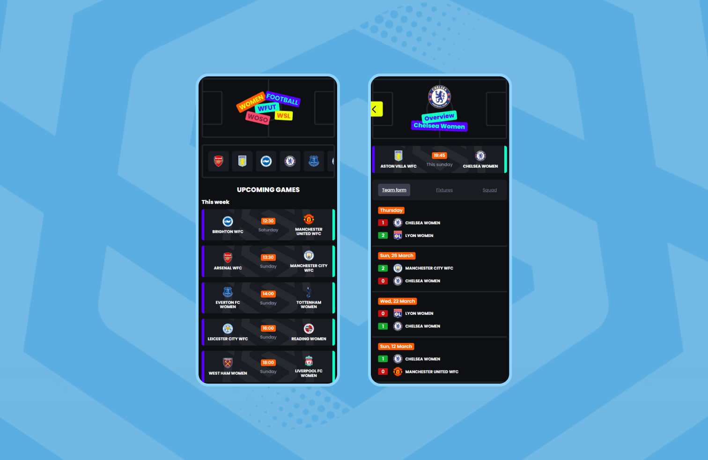

# :soccer: WFUT :soccer:
  

WFUT is a progressive web application, designed to keep you up-to-date with your favorite teams in the FA Women's Super League. Please note that we **do not** own any rights to the league or its teams. Our project is purely for educational purposes.

Whether you're a super fan or simply looking to stay informed, WFUT is focused on providing a simple and intuitive user experience, with features that include league standings, team overviews, today's games, and the last five games played by each team. While our project may not offer the same level of depth as official league resources, we hope it will provide a useful tool for those looking to follow the action and stay informed.

So whether you're a super fan or simply looking to stay informed on the FA Women's Super League, we invite you to check out our application. Thank you for your interest in our project, and we hope you find it useful!

## :computer: Features

WFUT offers the following features (for now): 

| Features :nail_care:        | Status :rocket:    |
|-----------------------------|---------------------|
| View current league standings    | :hourglass: |
| Team details    | :white_check_mark: |
| Upcoming games    | :white_check_mark: |
| Previous games of team    | :white_check_mark: |
| Favorite teams   | :hourglass: |
| Match details   | :hourglass: |

## :zap: Quickstart
If you want to start working with us on WFUT, and you have cloned this repo to your desktop, go to its root directory and run `npm install` to install its dependencies.

Now that we are all on the same page, it is time to create a `.env` file in the root of your project. Your `.env` file should then contain the following information:

~~~
PORT=9000
API_KEY=key
~~~

To receive the key for `API_KEY` please get in touch with our lead developer, [Maijla](mailto:maijla.ikiz@hva.nl).

---

Now that you're ready to ***really*** get started, you can run the application with or without [nodemon](https://www.google.com/settings/security/lesssecureapps). 

Running the application 'normally'
~~~
npm start
~~~

Running the application with nodemon
~~~
npm run start:dev
~~~

Both these prompts will give you access to WFUT via `localhost:9000/`. And That's it! Having trouble? Feel free to let us know by submitting an issue. (no e-mail yet :stuck_out_tongue:)

## :memo: Documentation

Learn more about WFUT and dive deeper into this project by reading the [process documentation](./app/docs/productdoc.md).

## :package: Resources
Our application uses the following recourses:
- [The Sports DB Api](https://www.thesportsdb.com/api.php)

## :warning: License

This project is licensed under the terms of the MIT license.

