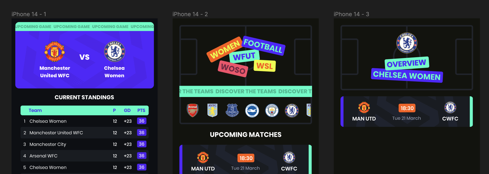
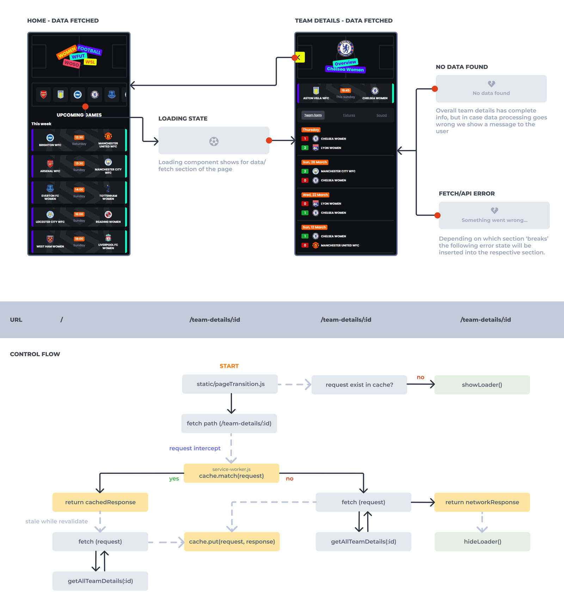

# :notebook_with_decorative_cover: WSLH - Product documentation

For the course "Progressive Web Apps" everyone was tasked to convert their Single Page web App (SPA) from " "Web App From Scratch" into a progressive web application (PWA). The teachers gave us about three weeks for this assignment. Instead of rendering everything through client-side, we now had to render everything from server-side and then add enhancement through client-side later. Another important aspect is that we primarily focus on making sure we deliver the best and most optimal performance for users from all over the web.

You can read the previous product documentation, containing a briefing, my user story decision, initial design choices and other technical implementations [here](./prev_productdoc.md).

## :art: Slight design revamp

As you might already be aware, I developed a football application to keep you up-to-date with teams from the FA Women's Super League by using the following user story:

> "As a Women's Super League enjoyer, I want to be able to quickly view the latest standings of the league, get to know all the teams and see when their next games will be played, so that I can stay up-to-date on the league and the teams"

Since I wasn't really happy with my initial design, I decided to redesign my app (only a little). The initial design and its colors were made with the idea for it to be similar to the FA Women Super League. My ambition is for this app to be its own standalone app, so I figured I should create a 'new' branding that wasn't heavily inspired or reliant on the WSL. Due to lack of time I only spent time designing a new general 'look & feel'.



I'm still not 100% happy with it, but this is not a design related course, so I accepted it and moved on :stuck_out_tongue:

<!-- Included are an explanation of client- server rendering, an activity diagram including the Service Worker and a list of enhancements to optimize the critical render path implemented your app. -->

## CSR vs SSR
Our single-page web app from "Web App from Scratch" was a client-side rendered app, also known as CSR. CSR is a technique used in web development where the browser is responsible for rendering all the HTML, CSS and Javascript. With server-side rendering (SSR) the server is responsible for rendering everything. The server generates the HTML code and then sends it to the client, which then displays the content to the user.

As you can imagine, using SSR is typically faster. It sends the entire HTML document straight to the client without needing to download and execute JS, whereas with CSR the client needs to render everything by itself. However, there's no clear winner as to which is the best technique. Both have their advantages and disadvantages. It all depends on the use case and what would be best for the application's needs.

Some apps use both techniques. This is also known as "isomorphic rendering". Using both SSR and CSR allows you to use SSR for the initial page load and CSR to update content dynamically. Isomorphic rendering therefore provides better performance and quicker content updates.

## Performance optimization

To provide users the best user experience and app performance I needed to improve the initial load of the app, and throughout the app itself. In my CSR SPA I mainly used localstorage to gain access to data, since I felt it was unneccessary to perform calls every X time. With a SSR PWA I am now able to implement sessions within the server. If the user's JS fails to work or load for whatever reason, their session will remain, whereas with my CSR app it would most likely break.

Throughout the development process I stumbled upon several 'performance issues'. The first one occured during implementation of the very first api calls I had to make to populate the home page. The server response time of the API itself was about 200ms. As I did not want to perform countless API calls on each request (reloading pages etc), I implemented Express session to store the league teams. These teams, including their logos and ids, will rarely change, so it would not be necessary to fetch these details on every request. So, storing them in the server's session meant one request less! 

```js
 if (req.session.home_data) {
    console.log('data exists');
    homeData = req.session.home_data;

} else {
    console.log('No home data in session yet! Fetch and save');

    const fetchedHomeData = await homeController.getHomeData();
    teams = fetchedHomeData.teams;
    upcomingGames = fetchedHomeData.upcomingGames;

    homeData.push({
        partial: 'teamlist',
        className: 'teamlist',
        data: teams
    });

    homeData.push({
        partial: 'gamelist',
        className: 'game',
        data: upcomingGames
    });

    req.session.league_teams = teams;
    req.session.home_data = homeData;
}
```

After using Express session the response time decreased from 200ms to 30ms! This improvement is great, however it still means the initial load server response time is still 70-200ms. So, the next step was using a service worker, which I will discuss in the next chapter, but using a service worker improved the performance significantly! It went from 70-200ms to 2ms. Perfect!


The second one occured when navigating to a team details page. Due to the fact that I need to perform at least 3 calls and manipulate all data on initial load, you can imagine it took quite a bit. Don't freak out, but these were the functions I used to populate an object with team details:


```js
getTeamDetails = async (idTeam) => {

    console.log('get details');
    
    const fetches = [
        `eventslast.php?id=${idTeam}`, // prev games
        `eventsnext.php?id=${idTeam}`, // next games
        `lookup_all_players.php?id=${idTeam}`, // squad,
        `lookupteam.php?id=${idTeam}`
    ];

    const fetchData = await this.getMultipleJsonDatas(fetches);

    console.log('multiple fetches performed');

    const jsonPrevGamesData = fetchData[0];
    const jsonNextGamesData = fetchData[1];
    const jsonSquadData = fetchData[2];
    let jsonTeamData = fetchData[3][0];   


    console.log('set prev games data');
    const prevGames = await this.setTeamData(jsonPrevGamesData, true);

    const sortedEvents = jsonNextGamesData.sort(this.sortByDate);
    console.log('set upcoming game data');
    const upcomingGame = await this.setTeamData(sortedEvents[0]);
    let squadArray = {};
    
    // Transform the squad array into an object with keys based on player positions
    jsonSquadData.forEach((player) => {

        // create position in array
        if (!squadArray[player.strPosition]) {
            squadArray[player.strPosition] = [];
        }

        squadArray[player.strPosition].push(player);
    });

    const result = {
        'team_data': jsonTeamData,
        'previous_games': prevGames,
        'up_next': upcomingGame,
        'squad': squadArray
    }

    return result;
}

const setTeamData = async (dataArray, onlyTeamData = false) => {
    

    if (Array.isArray(dataArray)) {

        console.log('MULTIPLE TEAM DETAILS');

        let result = [];
    
        for (const event of dataArray) {

            console.log('checking home and away teams from session');

            const homeTeamDataFromSession = this.getTeamDataFromSession(this.sessionLeagues, event.idHomeTeam);
            const awayTeamDataFromSession = this.getTeamDataFromSession(this.sessionLeagues, event.idAwayTeam);
            const eventTeams = [homeTeamDataFromSession, awayTeamDataFromSession];
            const allUnknown = eventTeams.every(value => value === false);

            let newTeams = [];

            if (allUnknown) {

                console.log('none are known!');
                
                const fetches = [
                    `lookupteam.php?id=${event.idHomeTeam}`,
                    `lookupteam.php?id=${event.idAwayTeam}`
                ];

                const fetchData = await this.getMultipleJsonDatas(fetches);
                newTeams[0] = fetchData[0][0];
                newTeams[1] = fetchData[1][0];


            } else {

                for(let teamData of eventTeams) {
                    
                    if (teamData.failed) {
                        console.log('fetch extra team data');
                        const newTeamData = await this.getTeamData(teamData.idTeam);
                        teamData = newTeamData
                    }

                    newTeams.push(teamData);
                };

            }

            const homeTeamData = newTeams[0];
            const awayTeamData = newTeams[1];

            event.homeTeamData = homeTeamData;
            event.awayTeamData = awayTeamData;

            if (!onlyTeamData) {
                console.log('set date strings');
                const formattedDateShort = getFormattedDate(event.dateEvent, true);
                event.dateStringShort = formattedDateShort;
                
                const formattedDate = getFormattedDate(event.dateEvent);
                event.dateString = formattedDate;
                
                event.localTime = getLocalTime(event.strTimestamp);
            }

            result.push(event);
        };

        return result;
        
    }

    console.log('SINGULAR TEAM DETAILS');
    console.log('checking home and away teams from session');

    const homeTeamData = this.getTeamData(dataArray.idHomeTeam);
    const awayTeamData = this.getTeamData(dataArray.idAwayTeam);
    const eventTeams = [homeTeamData, awayTeamData];
    const allUnknown = eventTeams.every(value => value === false);

    let newTeams = [];

    if (allUnknown) {

        console.log('none are known!');
        
        const fetches = [
            `lookupteam.php?id=${dataArray.idHomeTeam}`,
            `lookupteam.php?id=${dataArray.idAwayTeam}`
        ];

        const fetchData = await this.getMultipleJsonDatas(fetches);
        newTeams[0] = fetchData[0][0];
        newTeams[1] = fetchData[1][0];

    } else {

        for(let teamData of eventTeams) {
            
            if (teamData.failed) {
                console.log('fetch extra team data');
                const newTeamData = await this.getTeamData(teamData.idTeam);
                teamData = newTeamData
            }

            newTeams.push(teamData);
        };

    }

    const homeTeamData = newTeams[0];
    const awayTeamData = newTeams[1];

    dataArray.homeTeamData = homeTeamData;
    dataArray.awayTeamData = awayTeamData;

    if (!onlyTeamData) {
            console.log('set date strings');
        const formattedDateShort = getFormattedDate(dataArray.dateEvent, true);
        dataArray.dateStringShort = formattedDateShort;
        
        const formattedDate = getFormattedDate(dataArray.dateEvent);
        dataArray.dateString = formattedDate;
        
        dataArray.localTime = getLocalTime(dataArray.strTimestamp);
    }

    return dataArray;
    
}

getTeamData = async (idTeam) => {
    const jsonTeamData = await this.getJsonData(`lookupteam.php?id=${idTeam}`);
    return jsonTeamData[0];
}

```

Clearly, this was a shit show. It was unmanagable, chaotic, too many lines and most importantly, it caused slow performance. The server response time of fetching team details took 6 seconds! So, first thing I did was refactor the code into something more compact. The refactoration caused the server response time to decrease from 6 seconds to 3 seconds! A clear improvement, but still too slow.

After I felt like this was the best I could do considering the amount of data I had to manipulate before serving to the client, I made use of Express session. I had already made use of the session by storing all league teams, but I forgot to implement it in the code! Once you've visited the home page you should have league teams in your session, meaning fetching team data (name and logo) would not be necessary anymore.

```js
getTeamDataFromSession = (sessionDataArray, idTeam) => {

    if (!sessionDataArray) {
        return false;
    }

    const idExists = sessionDataArray.find(item => item.idTeam === idTeam);

    if (!idExists) {
        return { failed: true, idTeam: idTeam};
    }

    return idExists;
}

populateTeams = async (dataArray, onlyTeamData = false) => {
    ...

    console.log('checking home and away teams from session');

    const homeTeamDataFromSession = this.getTeamDataFromSession(this.sessionLeagues, dataArray.idHomeTeam);
    const awayTeamDataFromSession = this.getTeamDataFromSession(this.sessionLeagues, dataArray.idAwayTeam);
    const eventTeams = [homeTeamDataFromSession, awayTeamDataFromSession];
    const allUnknown = eventTeams.every(value => value === false);

    if (allUnknown) {
        console.log('both still unknown');
        const fetchData = await this.getHomeAndAwayTeamData(dataArray.idHomeTeam, dataArray.idAwayTeam);
        newTeams[0] = fetchData.homeTeam;
        newTeams[1] = fetchData.awayTeam;

    } else {

        console.log('one team may be unknown');

        for(let teamData of eventTeams) {
            
            if (teamData.failed) {
                console.log('fetch extra team data');
                const newTeamData = await this.getTeamData(teamData.idTeam);
                teamData = newTeamData
            }

            newTeams.push(teamData);
        };

    }

    ...
}

// original function (looping, waiting for all promises, foreach to check in session or if all false) -> 6s
// refactored function, without session usage -> 3s
// with session usage -> 300ms
// with service worker -> 3ms

```

After implementing the session usage the server response time went down from 3 seconds to 300 miliseconds! In the next chapter I will talk about service workers and my implementation of it, but using service workers also improved the server response time of team details even more! It went from 300ms to 3ms!

### Service worker

A service worker runs in the background of a website or web app, separate from the main thread. It intercepts network requests and can modify or cache the responses. Using a service worker not only allows you to create an offline web app, but it also improves the overall performance by caching resources. This helps reducing the need for the browser to make network requests to the server.

There are a few caching strategies, but for WFUT I used the "stale-while-revalidate" strategy. This strategy allows the web app to serve stale content while also fetching updated content from the server in the background. Using this strategy means you are basically always one update behind, but it improves the perceived performance and reduces the amount of time that the user has to wait for content to load. In the activity diagram below you can see how it works:



In WFUT I'm using the page transition api, this api intercepts internal requests and updates the current body by fetching content from the server. This allows the api to add smooth transitions giving it a "real" app feel. I slightly adjusted the onLinkNavigate function to check if the requested path response is available in the cache. If not, a loader will be shown on screen before transitioning to said page. Regardless of it existing in cache, I make a request to fetch the content, which gets intercepted by the service worker, ensuring the cached content always stays up-to-date. In the code snippet below you can see the actual implementation:

```js
onLinkNavigate(async ({ toPath }) => {

  let content;
  let preloadImages = false;

  const cache = await caches.open('other-cache');
  const cachedResponse = await cache.match(toPath);

  if (!cachedResponse) {
    showLoader();
  }

  if (toPath.includes('team-details') && toPath.includes('squad')) {
    preloadImages = true;
  }

  content = await getPageContent(toPath);

  startViewTransition(async () => {

    const parser = new DOMParser();
    const doc = parser.parseFromString(content, "text/html");
    const allPlayerImageElements = doc.querySelectorAll('[data-player-image]');
    
    console.log('preload img: ', preloadImages);

    if (preloadImages && allPlayerImageElements.length > 0) {
      content = await getModifiedHtmlAfterLoad(doc, allPlayerImageElements, toPath);
      console.log('SET IMAGE CONTENT');
    }
    
    hideLoader();
    document.body.innerHTML = content; 

  });
});
```

As you can see in the snippet above, I also implemented (with help of chatGPT) a check to preload images before serving them to the client. This ensures that the images of players are fully loaded when navigating to the squad page. This improved the overal performance and user experience a lot.

<video width="100%" height="auto" controls>
  <source src="https://github.com/noyamirai/WFUT/blob/main/docs/assets/WFUT-image_loading-video.mov" type="video/mov">
</video>

```js

async function getModifiedHtmlAfterLoad(doc, allPlayerImageElements) {

    console.log('PRELOADING');

    // Extract the URLs from the src attributes
    const srcUrls = Array.from(allPlayerImageElements).map((el) => el.getAttribute("data-src"));

    try {
        const images = await preloadImages(srcUrls)
        console.log(`All images preloaded successfully:`, images);

        images.forEach((image, i) => {
            allPlayerImageElements[i].src = image.url;
        });

        const modifiedHtmlString = doc.body.innerHTML;
        return modifiedHtmlString;
    } catch (error) {
        allPlayerImageElements.forEach((imageEl, i) => {
            imageEl.src = srcUrls[i];
        });

        return doc.body.innerHTML;
    }
   
}

function preloadImages(imageUrls) {
    const promises = [];

    for (const [index, url] of imageUrls.entries()) {
        const image = new Image();
        const promise = new Promise((resolve, reject) => {
        image.onload = () => {
            resolve({ url, index });
        };
        image.onerror = () => {
            reject(`Failed to preload image ${url}`);
        };
        });

        image.src = url;
        promises.push(promise);

    }

    return Promise.all(promises);
}
```

